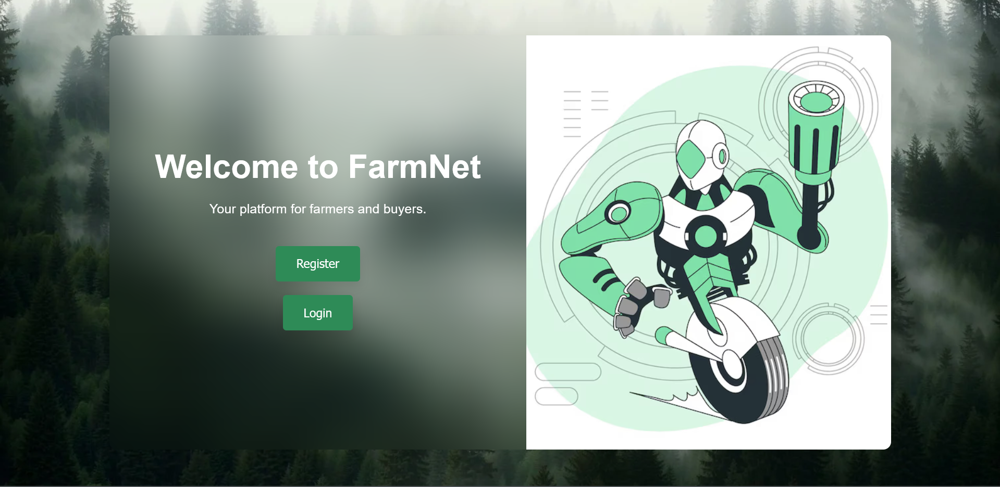
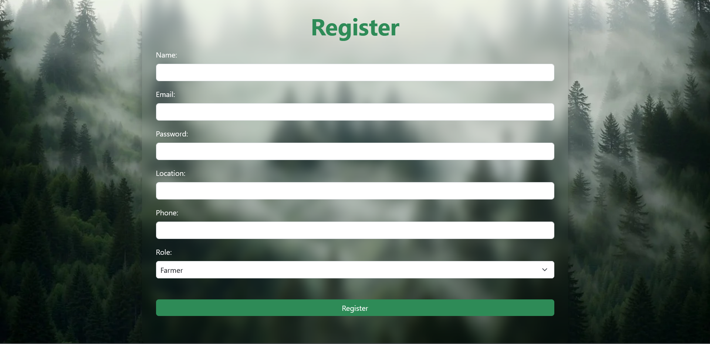
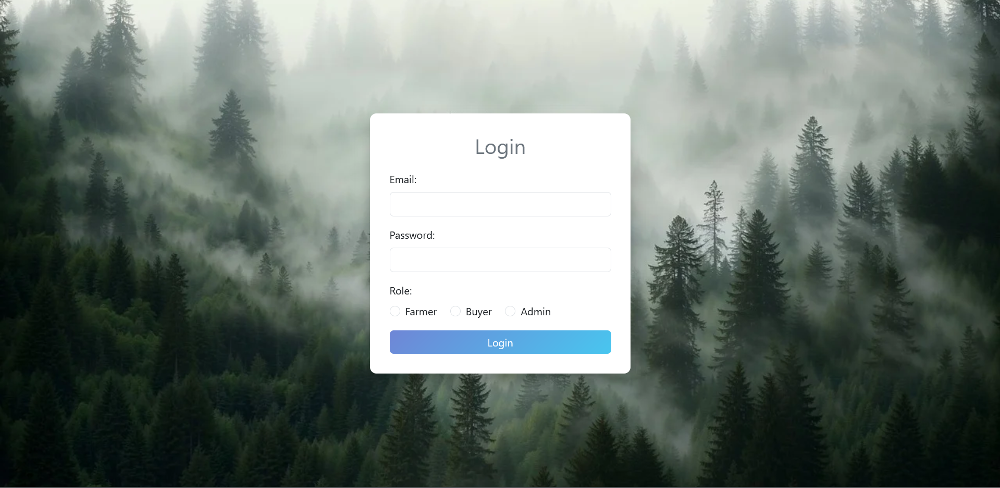
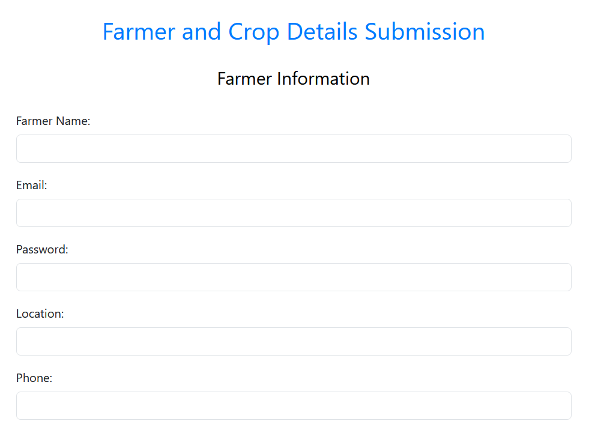
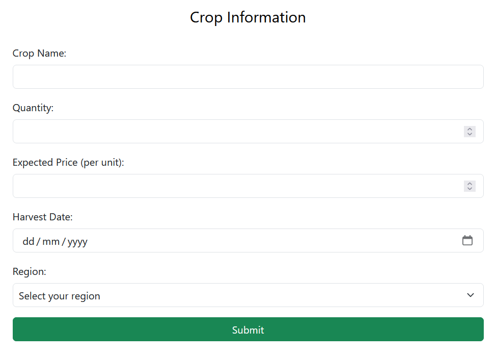
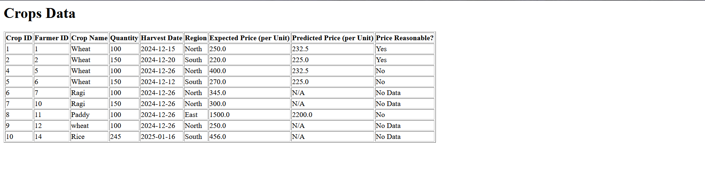
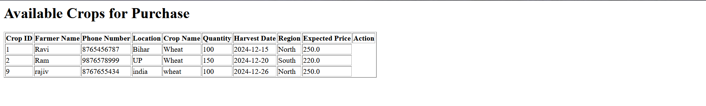
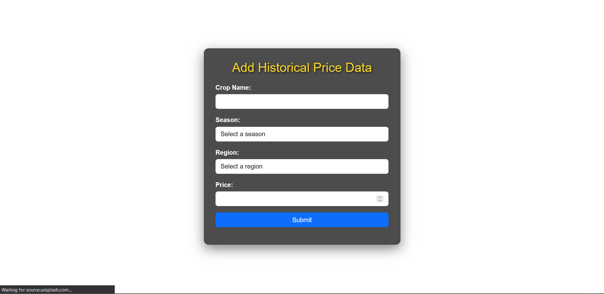

# FarmNet

FarmNet is an intuitive and comprehensive web application designed to connect farmers and buyers. It offers powerful tools for crop price prediction and facilitates direct transactions, aiming to improve efficiency in agricultural commerce. With a secure, user-friendly interface and robust backend, FarmNet empowers stakeholders in the agricultural ecosystem.

## 🚀 Project Structure

```
- .settings/: IDE settings files.
- build/: Contains build artifacts generated by your build tool.
- src/: Main source code for the application.
  - main/
    - java/: Java source files.
      - dao/: Data Access Object classes for database interactions.
        - CropDAO.java
        - PricePredictionDAO.java
        - UserDAO.java
      - model/: Data model classes representing the application's data structure.
        - Crop.java
        - HistoricalPrice.java
        - User.java
      - servlet/: Servlet classes for handling HTTP requests and responses.
        - AddCropsServlet.java
        - BuyerServlet.java
        - LoginServlet.java
        - TransactionServlet.java
        - (and others)
    - util/: Utility classes for database connections and helper methods.
      - DatabaseConnection.java
      - HashUtil.java
- webapp/: Frontend resources.
  - frontend/
    - css/: Stylesheets for the application.
    - html/: HTML pages for user interaction.
    - js/: JavaScript files for adding dynamic functionality to the front end.
  - META-INF/: Contains metadata for web applications.
  - WEB-INF/: Contains web application configuration files and resources.
- README.md: This file.
```

## 🌐 System Architecture

1. **Frontend:** Utilizes HTML, CSS, JavaScript, and Chart.js for a modern, interactive UI.
2. **Backend:** Built with Java Servlets to handle business logic and HTTP requests efficiently.
3. **Database:** Relational databases like MySQL or PostgreSQL to store and manage user data and crop information.

## ✨ Key Features

### 1. **Home Page**
A welcoming introduction to FarmNet, highlighting its core purpose and offerings.

- **Navigation Options:**
  - **Login:** For existing farmers and buyers to access their accounts.
  - **Register:** For new users to sign up and join the platform.



### 2. **Register Page**
A seamless sign-up page for users to create an account.



### 3. **Login Page**
A secure login interface for returning users.



### 4. **Farmer Module**
- Add and manage crop details, and view predicted crop prices.
  
  
  


- List crops for sale and set their prices.
  
### 5. **Buyer Module**
- Search, filter, and view available crops for purchase.



- Contact farmers directly for transactions.

### 6. **Admin Module**
- Manage user accounts, data, and generate reports.

  


## 📥 Installation Guide

1. **Clone the Repository:**
   ```bash
   git clone https://github.com/VishnuKumarVerma/FarmNet.git
   cd FarmNet
   ```

2. **Set Up Database Connection:**
   ```bash
   cp src/util/DatabaseConnection.template.java src/util/DatabaseConnection.java
   ```
   Fill in your database credentials to establish the connection.

3. **Build the Project:**
   ```bash
   mvn clean install
   ```

4. **Run on a Local Server (e.g., Apache Tomcat):**
   Access the app at:
   ```
   http://localhost:8080/FarmNet/
   ```

## 📊 Price Prediction Algorithm

- **Data Fetching:** Historical price data is retrieved from the database.
- **Prediction Methods:** Algorithms like Weighted Average and Linear Regression are used for accurate price forecasting.
- **Visualization:** The predicted prices are displayed in interactive graphs using Chart.js, enabling farmers and buyers to make informed decisions.

## 🔐 Security Highlights

- **Hashed Passwords:** Passwords are hashed using secure algorithms to ensure safe user authentication.
- **Role-Based Access Control:** Different access levels are granted based on user roles (Farmer, Buyer, Admin).
- **Input Validation:** The app performs thorough input validation to prevent common security vulnerabilities like SQL injection.

## 🛠️ Contributing

We welcome contributions to make FarmNet even better! If you'd like to contribute:

1. Fork the repository.
2. Create a branch for your feature or bug fix.
3. Make your changes and commit them.
4. Submit a pull request with a description of your changes.
